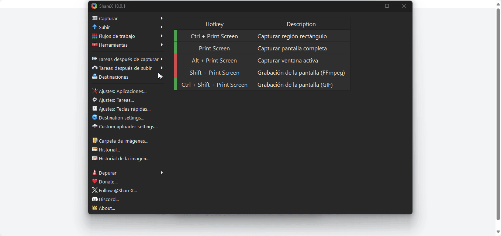

# EduGestión 360

**EduGestión 360** es una plataforma web full-stack e integral de gestión académica, diseñada para centralizar y optimizar la comunicación y los procesos entre directivos, docentes y estudiantes. El proyecto está 100% contenedorizado con Docker.




---

## Core del Proyecto: Lógica de Roles Segura

El pilar de esta aplicación es su sistema de autenticación y autorización basado en roles (RBAC).

* **Autenticación:** Realizada mediante `Simple JWT` (JSON Web Tokens). El frontend recibe un `accessToken` y un `refreshToken` al iniciar sesión.
* **Autorización:** El backend utiliza permisos a nivel de API (`IsDirectivo`, `IsDocente`) y lógica de negocio a nivel de *queryset* para asegurar que los usuarios solo puedan acceder y modificar los datos que les corresponden.
    * **Ejemplo (GET):** Un usuario con rol `estudiante` que llama a `GET /api/calificaciones/` solo verá sus propias notas.
    * **Ejemplo (POST):** Un usuario con rol `docente` que llama a `POST /api/calificaciones/` crea una nota, y el backend le asigna automáticamente su `docente_id` como autor.

---

## Stack Tecnológico

Este proyecto demuestra un flujo de trabajo full-stack moderno, desde el desarrollo de la API hasta el despliegue en contenedores.

### Frontend
* **Framework:** React 18+ (con Vite)
* **Gestión de Estado:** React Hooks (`useState`, `useEffect`, `useContext`)
* **Routing:** `react-router-dom`
* **Estilos:** TailwindCSS (Diseño responsivo y moderno)
* **Formularios:** `react-hook-form` (Alto rendimiento) y `yup` (Validación de esquemas)
* **Peticiones API:** `axios`

### Backend
* **Framework:** Python 3.10+ con Django 4+
* **API:** Django REST Framework (DRF)
* **Autenticación:** `djangorestframework-simplejwt` (Tokens JWT)
* **Base de Datos:** MySQL (manejada por Docker)
* **Servidor WSGI:** Gunicorn

### Infraestructura y DevOps
* **Contenerización:** Docker
* **Orquestación:** Docker Compose
* **CORS:** `django-cors-headers` para comunicación segura entre dominios (Frontend/Backend).

---

## Características Principales

* 🔐 **Autenticación Segura:** Sistema de Login y Registro basado en roles (Estudiante, Docente, Directivo).
* 👨‍🎓 **Portal del Estudiante:** Dashboard para consultar calificaciones en tiempo real.
* 👩‍🏫 **Panel del Docente:** Interfaz para crear, leer y gestionar calificaciones por estudiante y materia.
* 📊 **Panel del Directivo (En desarrollo):** Gestión de usuarios (CRUD) y visualización de estadísticas globales.
* 🧱 **API RESTful:** Endpoints modulares y seguros para gestionar Usuarios, Cursos, Materias y Calificaciones.
* 🐳 **100% Contenerizado:** El proyecto completo (React, Django, MySQL) se levanta con un solo comando gracias a Docker Compose.

---

## API Endpoints (Muestra)

| Método | Endpoint | Rol Requerido | Descripción |
| :--- | :--- | :--- | :--- |
| `POST` | `/api/login/` | Público | Obtiene tokens JWT (Access y Refresh). |
| `GET` | `/api/calificaciones/` | Estudiante | Devuelve **solo** las calificaciones del estudiante autenticado. |
| `GET` | `/api/calificaciones/` | Docente | Devuelve las calificaciones creadas **por** el docente autenticado. |
| `POST` | `/api/calificaciones/` | Docente | Crea una nueva calificación. El `docente_id` se asigna automáticamente. |
| `GET` | `/api/users/?role=estudiante` | Docente | Devuelve una lista filtrada de todos los usuarios con rol `estudiante`. |
| `GET` | `/api/me/` | Autenticado | Devuelve los datos del usuario (`user`) almacenados en el token. |

---

## 🚀 Cómo Ejecutar Localmente

Este proyecto está diseñado para ejecutarse con Docker.

1.  **Clonar el repositorio:**
    ```bash
    git clone [https://github.com/](https://github.com/)[TU_USUARIO_GITHUB]/edugestion360-fullstack.git
    cd edugestion360-fullstack
    ```

2.  **Configurar Variables de Entorno:**
    Crea un archivo `.env` en la raíz del proyecto. Debe contener las credenciales de la base de datos y la configuración de Django:

    ```env
    # Variables de la Base de Datos
    DATABASE_NAME=edugestion_db
    DATABASE_USER=edugestion_user
    DATABASE_PASSWORD=edugestion_pass
    DATABASE_HOST=db
    DATABASE_PORT=3306

    # Variables de Django
    DJANGO_DEBUG=True
    DJANGO_SECRET_KEY=tu_secret_key_aqui_(puedes_generar_una_larga_y_aleatoria)
    DJANGO_ALLOWED_HOSTS=localhost,127.0.0.1

    # Variables de CORS (Apunta a tu frontend de Vite)
    CORS_ALLOWED_ORIGINS=http://localhost:5173,[http://127.0.0.1:5173](http://127.0.0.1:5173)
    ```

3.  **Construir y Levantar los Contenedores:**
    Este comando construirá las imágenes de React y Django, e iniciará todos los servicios.
    ```bash
    docker compose up --build -d
    ```

4.  **Ejecutar Migraciones:**
    Aplica el esquema de la base de datos.
    ```bash
    docker compose exec backend python manage.py migrate
    ```

5.  **Crear un Superusuario (Opcional):**
    Para acceder al Admin de Django (`http://localhost:8000/admin/`).
    ```bash
    docker compose exec backend python manage.py createsuperuser
    ```

6.  **¡Listo!**
    * **Frontend (React):** `http://localhost:5173`
    * **Backend (Django API):** `http://localhost:8000`

---

## Autor

* **[Jordy Fabian Villamil Letrado]**
* [[LinkedIn](https://www.linkedin.com/in/jordy-fabian-villamil-letrado-32378b232/)]
* [[Portafolio web](https://jordyvillamil.github.io/#contactame)]